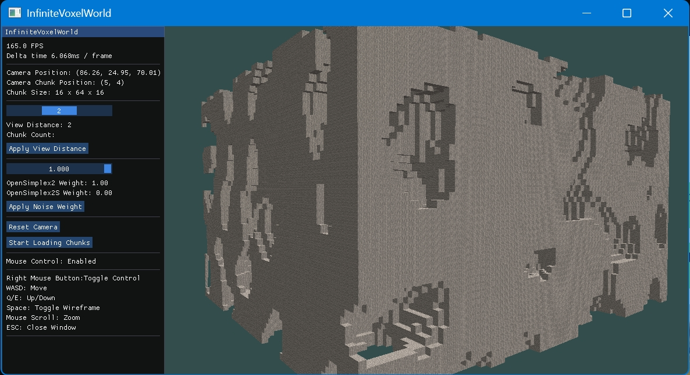

# 程序化生成体素洞穴地形 Procedural Generation of Infinite Voxel Cave Terrain

## Introduce 简介

This is a Windows-based project for procedurally generating voxel caves. It primarily implements chunk-based data structures, uses noise functions as thresholds for cave and terrain generation, employs OpenGL to render voxel terrain, optimizes performance with voxel face culling and frustum culling, and utilizes multithreading to separate rendering from generation logic, enabling the creation of an infinite voxel cave terrain.

这是一个Windows平台的程序化生成体素洞穴工程, 主要实现了以区块为数据结构, 以噪声为洞穴和地形的生成阈值, 使用OpenGL渲染体素地形, 使用体素相邻面剔除和视锥体剔除技术优化性能, 使用多线程将渲染与生成逻辑分离, 实现生成无限大的体素洞穴地形的程序

## Features 特性

- Voxel Chunk Data Structure: Uses chunks as the basic data structure for managing and rendering the scene.
- Noise-based Cave and Terrain Generation: Defines generation thresholds for caves and terrain using noise functions to simulate natural landscapes.
- OpenGL Rendering: Renders voxel terrain using OpenGL technology.
- Performance Optimization:
  - Voxel Face Culling: Renders only visible voxel faces, reducing unnecessary rendering load.
  - Frustum Culling: Renders only the chunks within the view frustum, improving rendering performance.
  - Multithreading: Separates rendering and generation logic, enabling parallel processing of generation and rendering.

- 体素区块数据结构: 使用区块作为基础数据结构，实现场景的管理和渲染。
- 噪声生成洞穴和地形: 利用噪声函数定义洞穴和地形的生成阈值，模拟自然地形。
- OpenGL渲染: 使用OpenGL技术实现体素地形渲染。
- 性能优化:
  - 体素相邻面剔除: 仅渲染可见的体素面，减少不必要的渲染开销。
  - 视锥体剔除: 仅渲染在视野范围内的区块，提高渲染性能。
  - 多线程处理: 渲染与生成逻辑分离，实现生成和渲染的并行处理。

## Installation and Usage 安装与使用

### System Requirements 系统需求

 - Windows
 - OpenGL3.0+
 - Visual Studio 2022

## Installation Steps 安装步骤 

Simply clone the repository and double-click the .sln file to open it with Visual Studio.

直接克隆仓库并双击sln使用VisualStudio打开即可

## Screenshot 示例截图

## Contact Information 联系方式

Email: mickeymiao2023@163.com
WeChat: SiMiao1106
