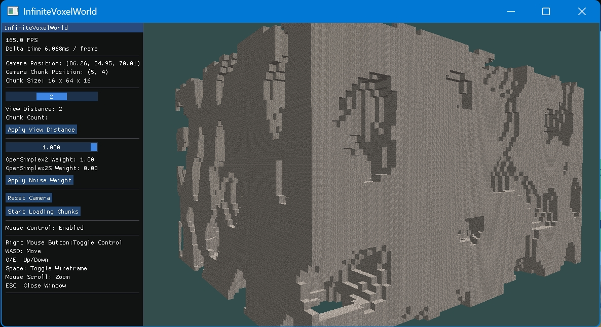

# Infinite Voxel Cave World

A cross-platform (Windows / Linux) voxel engine that procedurally generates infinite cave terrain in real time using OpenGL.

一个跨平台的体素引擎，使用 OpenGL 实时程序化生成无限洞穴地形。



## Features

- **Procedural Terrain & Caves** — Dual-noise (OpenSimplex2 / OpenSimplex2S) blending with configurable weights and thresholds
- **Chunk-based World** — 16×64×16 chunks loaded/unloaded dynamically around the camera
- **Optimized Rendering**
  - Per-chunk persistent VAO/VBO (uploaded once, drawn every frame)
  - Neighbor-aware face culling — only exposed faces are rendered, including across chunk boundaries
  - Frustum culling — off-screen chunks are skipped entirely
- **Multithreaded** — Chunk generation runs on a background thread; rendering stays on the main thread with mutex-protected shared state
- **Visual Quality** — Blinn-Phong lighting, distance fog, directional ambient occlusion, edge darkening
- **ImGui Debug Panel** — Real-time FPS, camera position, view distance slider, noise weight tuning

## Tech Stack

| Component | Library |
|-----------|---------|
| Windowing & Input | GLFW 3 |
| OpenGL Loader | glad |
| Math | GLM |
| Noise | FastNoiseLite |
| Image Loading | stb_image |
| Debug UI | Dear ImGui |

## Getting Started

### Prerequisites

- **Windows**: Visual Studio 2022, OpenGL 3.3+
- **Linux**: CMake 3.16+, OpenGL 3.3+

```bash
# Ubuntu / Debian
sudo apt install cmake libglfw3-dev libgl-dev
```

### Build & Run

**Linux (CMake)**

```bash
git clone https://github.com/WangSimiao2000/InfiniteVoxelCaveWorld.git
cd InfiniteVoxelCaveWorld
cmake -B build && cmake --build build
./build/InfiniteVoxelCaveWorld
```

**Windows (Visual Studio)**

Open `InfiniteVoxelWorld.sln` with Visual Studio 2022 and build.

## Controls

| Key | Action |
|-----|--------|
| Right Mouse Button | Toggle camera control |
| W / A / S / D | Move forward / left / backward / right |
| Q / E | Move down / up |
| Mouse | Look around (when camera control enabled) |
| Scroll Wheel | Zoom in / out |
| Space | Toggle wireframe mode |
| ESC | Quit |

## Project Structure

```
├── src/                    # Application source code
│   ├── main.cpp            # Entry point, render loop, ImGui
│   ├── Chunk.h/cpp         # Voxel chunk: generation, face culling, GPU upload
│   ├── ChunkManager.h/cpp  # Chunk lifecycle, threading, world queries
│   ├── Camera.h            # FPS camera (Euler angles)
│   ├── Frustum.h           # View frustum extraction & AABB test
│   └── Shader.h            # Shader compilation & uniform helpers
├── shaders/
│   ├── VertexShader.vert
│   └── FragmentShader.frag # Blinn-Phong + fog + AO + edge darkening
├── textures/               # Texture assets
├── third_party/            # Vendored dependencies
│   ├── glad/               # OpenGL loader
│   ├── imgui/              # Dear ImGui
│   ├── stb/                # stb_image
│   └── FastNoiseLite/      # Noise library
├── OpenGL/                 # Windows-only headers & libs (GLFW, GLM)
├── CMakeLists.txt          # Linux build
└── InfiniteVoxelWorld.sln  # Windows build
```

## How It Works

1. **Terrain height** is computed per (x, z) column using 2D noise, producing a heightmap surface.
2. **Cave carving** uses 3D noise below the surface — voxels where the noise exceeds a threshold are hollowed out.
3. **Face culling** iterates each solid voxel and checks its 6 neighbors (including across chunk boundaries via `ChunkManager::isVoxelAtWorld`). Only exposed faces generate vertices.
4. **GPU upload** happens once per chunk on the main thread. The background thread handles generation and populates vertex data; the main thread detects new chunks and calls `uploadToGPU()`.
5. **Rendering** binds each chunk's VAO, sets the model matrix, and draws — no per-frame buffer allocation.

## Contact

- **Email**: mickeymiao2023@163.com
- **GitHub**: [WangSimiao2000](https://github.com/WangSimiao2000)
